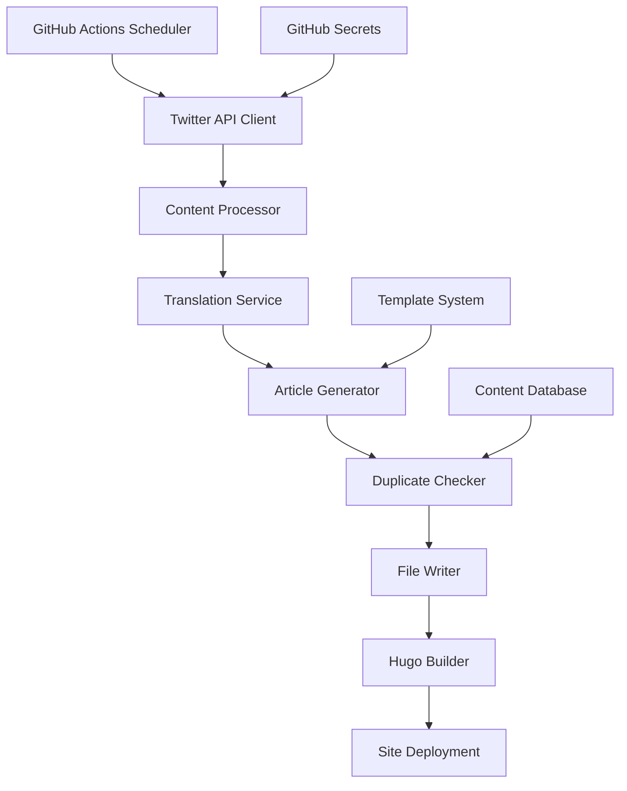

# Design Document

## Overview

The Twitter Crypto Content Automation system is a serverless automation solution that leverages GitHub Actions to discover trending cryptocurrency content on Twitter, translate it into Chinese, and automatically publish it as Hugo blog posts. The system runs twice daily and includes duplicate detection, content enhancement, and automatic site deployment.

## Architecture

### High-Level Architecture



### System Flow

1. **Trigger**: GitHub Actions cron schedule (9 AM & 9 PM Beijing time)
2. **Discovery**: Search Twitter API for trending crypto content
3. **Selection**: Identify top 3 most retweeted posts
4. **Processing**: Translate and enhance content
5. **Generation**: Create markdown articles using template
6. **Validation**: Check for duplicates and quality
7. **Publishing**: Commit to repository and build site
8. **Deployment**: Generate HTML and update live site

## Components and Interfaces

### 1. Twitter API Client

**Purpose**: Interface with Twitter API to search and retrieve trending cryptocurrency content.

**Key Functions**:
- `searchTweets(keywords, count)`: Search for tweets with crypto keywords
- `getTweetDetails(tweetId)`: Retrieve full tweet information including metrics
- `getRateLimitStatus()`: Monitor API usage and limits

**Configuration**:
- API endpoint: `https://api.twitter.com/2/tweets/search/recent`
- Authentication: Bearer token stored in GitHub Secrets
- Rate limiting: 300 requests per 15-minute window
- Search parameters: Include retweet count, author info, creation date

**Keywords Strategy**:
```javascript
const cryptoKeywords = [
  "cryptocurrency OR crypto",
  "blockchain OR bitcoin OR BTC", 
  "ethereum OR ETH OR DeFi",
  "NFT OR Web3 OR altcoin",
  "加密货币 OR 区块链 OR 比特币"
];
```

### 2. Content Processor

**Purpose**: Analyze and rank tweets by engagement metrics.

**Key Functions**:
- `rankTweetsByEngagement(tweets)`: Sort tweets by retweet count
- `extractTweetContent(tweet)`: Parse tweet text, media, and metadata
- `validateContentQuality(tweet)`: Filter out low-quality or spam content

**Ranking Algorithm**:
- Primary: Retweet count (weighted 60%)
- Secondary: Like count (weighted 25%)
- Tertiary: Reply count (weighted 15%)
- Quality filters: Minimum character count, spam detection

### 3. Translation Service

**Purpose**: Translate English tweets to Chinese and enhance content.

**Key Functions**:
- `translateText(text, targetLang)`: Translate tweet content to Chinese
- `enhanceContent(originalTweet, translation)`: Add context and analysis
- `generateTitle(content)`: Create engaging Chinese titles

**Translation Strategy**:
- Primary: Use Google Translate API or similar service
- Fallback: Built-in translation dictionary for crypto terms
- Enhancement: Add market context and technical explanations
- Quality check: Ensure translation accuracy for technical terms

### 4. Article Generator

**Purpose**: Create comprehensive markdown articles from processed tweets.

**Key Functions**:
- `generateArticle(tweetData, translation)`: Create full article content
- `applyTemplate(content, metadata)`: Use md-template.md structure
- `generateMetadata(tweet)`: Create front matter with tags and categories

**Template Structure**:
```markdown
+++
date = '{{date}}'
draft = false
title = '{{chineseTitle}}'
description = '{{description}}'
tags = [{{cryptoTags}}]
categories = ['推文分析']
keywords = [{{keywords}}]
+++

{{enhancedContent}}

## 原始推文信息
- 作者: {{author}}
- 发布时间: {{publishTime}}
- 转发数: {{retweetCount}}
- 点赞数: {{likeCount}}

{{authorInfo}}
```

### 5. Duplicate Checker

**Purpose**: Prevent publishing duplicate or similar content.

**Key Functions**:
- `checkDuplicate(tweetId, content)`: Verify content uniqueness
- `generateContentHash(content)`: Create content fingerprint
- `updateProcessedList(tweetId, hash)`: Maintain processed content record

**Duplicate Detection Strategy**:
- Tweet ID tracking: Maintain list of processed tweet IDs
- Content hashing: SHA-256 hash of normalized tweet content
- Similarity detection: Compare key phrases and topics
- Storage: Use GitHub repository file or GitHub API for persistence

**Storage Format**:
```json
{
  "processedTweets": [
    {
      "tweetId": "1234567890",
      "contentHash": "abc123...",
      "processedDate": "2025-08-14T09:00:00Z",
      "filename": "crypto-trend-analysis-20250814.md"
    }
  ]
}
```

### 6. File Writer

**Purpose**: Create and manage markdown files in the Hugo content structure.

**Key Functions**:
- `writeArticleFile(content, filename)`: Save markdown to /content/posts
- `generateFilename(title, date)`: Create descriptive filenames
- `validateFileStructure(content)`: Ensure Hugo compatibility

**File Naming Convention**:
```
crypto-twitter-{topic}-{YYYYMMDD}-{sequence}.md
```

Example: `crypto-twitter-bitcoin-analysis-20250814-001.md`

### 7. Hugo Builder

**Purpose**: Generate HTML pages from markdown content.

**Key Functions**:
- `buildSite()`: Execute Hugo build commands
- `validateBuild()`: Check for build errors
- `optimizeOutput()`: Minify and optimize generated files

**Build Process**:
```bash
# Install Hugo (if needed)
wget https://github.com/gohugoio/hugo/releases/download/v0.119.0/hugo_extended_0.119.0_Linux-64bit.tar.gz

# Build site
hugo --minify --gc

# Verify output
ls -la public/posts/
```

## Data Models

### Tweet Data Model

```typescript
interface TweetData {
  id: string;
  text: string;
  author: {
    username: string;
    displayName: string;
    verified: boolean;
    followerCount: number;
  };
  metrics: {
    retweetCount: number;
    likeCount: number;
    replyCount: number;
    quoteCount: number;
  };
  createdAt: string;
  url: string;
  media?: MediaAttachment[];
}
```

### Article Data Model

```typescript
interface ArticleData {
  frontMatter: {
    date: string;
    title: string;
    description: string;
    tags: string[];
    categories: string[];
    keywords: string[];
    draft: boolean;
  };
  content: string;
  originalTweet: TweetData;
  filename: string;
  contentHash: string;
}
```

### Configuration Model

```typescript
interface SystemConfig {
  twitter: {
    apiKey: string;
    bearerToken: string;
    searchKeywords: string[];
    maxResults: number;
  };
  translation: {
    service: 'google' | 'azure' | 'local';
    apiKey?: string;
    targetLanguage: string;
  };
  hugo: {
    buildCommand: string;
    outputDir: string;
    baseURL: string;
  };
  github: {
    repository: string;
    branch: string;
    contentPath: string;
  };
}
```

## Error Handling

### Error Categories and Responses

1. **API Errors**
   - Twitter API rate limits: Implement exponential backoff
   - Authentication failures: Log error and skip execution
   - Network timeouts: Retry with increased timeout

2. **Content Processing Errors**
   - Translation failures: Use fallback translation or skip tweet
   - Template errors: Log error and use default template
   - File write errors: Retry with different filename

3. **Build Errors**
   - Hugo build failures: Log detailed error and continue with existing site
   - Git commit failures: Retry with different commit message
   - Deployment errors: Alert maintainer but don't fail entire process

### Error Recovery Strategies

```javascript
async function executeWithRetry(operation, maxRetries = 3) {
  for (let attempt = 1; attempt <= maxRetries; attempt++) {
    try {
      return await operation();
    } catch (error) {
      if (attempt === maxRetries) {
        throw error;
      }
      await sleep(Math.pow(2, attempt) * 1000); // Exponential backoff
    }
  }
}
```

## Testing Strategy

### Unit Testing

**Components to Test**:
- Twitter API client functions
- Content processing and ranking algorithms
- Translation and content enhancement
- Duplicate detection logic
- File generation and naming

**Test Framework**: Jest with GitHub Actions integration

**Sample Test Cases**:
```javascript
describe('Content Processor', () => {
  test('should rank tweets by engagement correctly', () => {
    const tweets = [
      { retweetCount: 100, likeCount: 500 },
      { retweetCount: 200, likeCount: 300 },
      { retweetCount: 150, likeCount: 400 }
    ];
    const ranked = rankTweetsByEngagement(tweets);
    expect(ranked[0].retweetCount).toBe(200);
  });
});
```

### Integration Testing

**Test Scenarios**:
- End-to-end workflow from Twitter search to Hugo build
- API integration with rate limiting
- File system operations and Git commits
- Error handling and recovery mechanisms

### Manual Testing

**Test Checklist**:
- [ ] Twitter API authentication and search functionality
- [ ] Content translation quality and accuracy
- [ ] Duplicate detection effectiveness
- [ ] Hugo build process and HTML generation
- [ ] GitHub Actions scheduling and execution
- [ ] Site deployment and content visibility

### Performance Testing

**Metrics to Monitor**:
- API response times and rate limit usage
- Content processing duration
- Hugo build time
- Total workflow execution time (target: < 10 minutes)

## Security Considerations

### API Key Management
- Store all sensitive credentials in GitHub Secrets
- Use least-privilege access tokens
- Rotate API keys regularly
- Monitor API usage for anomalies

### Content Security
- Validate and sanitize all user-generated content
- Implement content filtering for inappropriate material
- Ensure proper HTML escaping in generated content
- Monitor for potential spam or malicious content

### Repository Security
- Use fine-grained personal access tokens
- Limit repository access to necessary operations
- Implement branch protection rules
- Monitor commit history for unauthorized changes

## Deployment and Operations

### GitHub Actions Workflow

```yaml
name: Twitter Crypto Content Automation
on:
  schedule:
    - cron: '0 1,13 * * *'  # 9 AM and 9 PM Beijing time (UTC+8)
  workflow_dispatch:  # Manual trigger for testing

jobs:
  generate-content:
    runs-on: ubuntu-latest
    steps:
      - name: Checkout repository
      - name: Setup Node.js
      - name: Install dependencies
      - name: Run content generation
      - name: Setup Hugo
      - name: Build site
      - name: Commit and push changes
```

### Monitoring and Alerting

**Key Metrics**:
- Workflow success/failure rates
- API quota usage
- Content generation statistics
- Site build performance

**Alerting Strategy**:
- Email notifications for workflow failures
- Slack integration for daily summaries
- GitHub Issues for persistent problems

### Maintenance Tasks

**Daily**:
- Monitor workflow execution logs
- Check API quota usage
- Verify content quality

**Weekly**:
- Review generated content for quality
- Update cryptocurrency keywords if needed
- Check for new Twitter API features

**Monthly**:
- Rotate API keys
- Review and optimize performance
- Update dependencies and Hugo version