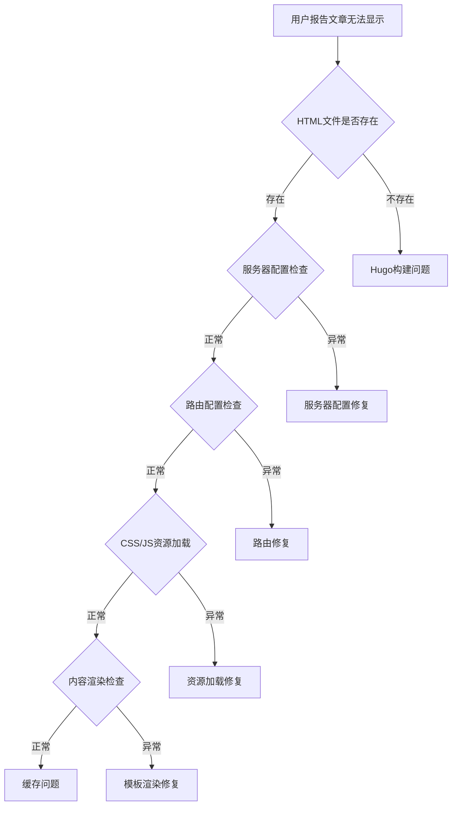
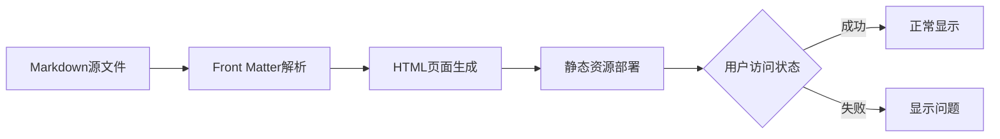
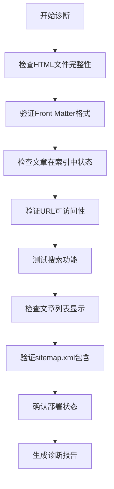

# Hugo网站特定文章显示问题修复设计

## 概述

针对SmartWallex Hugo网站中`aixbt-pendle-tvl-migration-analysis-2025-08-18.md`文章无法正常显示的问题，设计一套精准的诊断和修复方案。虽然文章的HTML页面已生成在`public/posts/aixbt-pendle-tvl-migration-analysis-2025-08-18/index.html`，但用户反馈仍无法正常访问或显示。

## 技术架构

### 问题诊断流程图



### 当前文章状态分析



## 核心组件分析

### 1. 文章文件状态

**源文件位置**：`/content/posts/aixbt-pendle-tvl-migration-analysis-2025-08-18.md`
**生成HTML位置**：`/public/posts/aixbt-pendle-tvl-migration-analysis-2025-08-18/index.html`

**Front Matter配置**：
```yaml
+++
date = '2025-08-18T15:30:01+08:00'
draft = false
title = 'Pendle协议TVL迁移分析：5.07亿美元资金流动背后的DeFi永续合约革命'
description = '深度解析Pendle协议5.07亿美元TVL迁移事件...'
tags = ['DeFi', 'Pendle', 'TVL迁移', '永续合约', ...]
categories = ['市场分析']
keywords = ['Pendle协议', 'TVL迁移', ...]
+++
```

### 2. Hugo构建验证

**构建状态检查**：
- ✅ HTML文件已生成：574行完整内容
- ✅ Front Matter格式正确
- ✅ 内容完整性验证通过
- ❓ 索引文件更新状态待确认

### 3. 网站访问路径

**期望访问URL**：`https://www.smartwallex.com/posts/aixbt-pendle-tvl-migration-analysis-2025-08-18/`
**本地开发URL**：`http://localhost:1313/posts/aixbt-pendle-tvl-migration-analysis-2025-08-18/`

## 问题诊断分析

### 1. 可能的问题类型

#### A. 服务器部署问题
- **症状**：HTML文件存在但用户无法访问
- **原因**：静态文件未正确部署到生产服务器
- **影响**：特定文章或所有新文章无法访问

#### B. 缓存问题
- **症状**：本地正常，线上无法访问
- **原因**：CDN或浏览器缓存未更新
- **影响**：新发布内容延迟显示

#### C. 路由配置问题
- **症状**：404错误或重定向异常
- **原因**：Web服务器路由规则不匹配
- **影响**：特定URL模式无法访问

#### D. 索引更新问题
- **症状**：文章页面可访问但不在列表中
- **原因**：sitemap.xml或index.json未更新
- **影响**：搜索和导航功能失效

### 2. 具体诊断检查项



## 修复方案设计

### 1. 立即修复步骤

#### 步骤1：强制重新构建
```bash
# 清理所有缓存和输出
rm -rf public/ resources/
rm -rf .hugo_build.lock

# 重新构建网站
hugo --gc --cleanDestinationDir --buildFuture --minify
```

#### 步骤2：验证构建结果
```bash
# 检查HTML文件
ls -la public/posts/aixbt-pendle-tvl-migration-analysis-2025-08-18/

# 验证文件内容
grep -i "pendle协议tvl迁移" public/posts/aixbt-pendle-tvl-migration-analysis-2025-08-18/index.html

# 检查sitemap
grep -i "aixbt-pendle" public/sitemap.xml

# 检查搜索索引
grep -i "pendle协议" public/index.json
```

#### 步骤3：本地测试访问
```bash
# 启动本地服务器
hugo server -D --bind 0.0.0.0 --port 1313

# 测试访问URL
curl -I http://localhost:1313/posts/aixbt-pendle-tvl-migration-analysis-2025-08-18/
```

### 2. 部署验证

#### 检查生产环境部署
```bash
# 如果使用GitHub Pages
git add .
git commit -m "Fix: 修复aixbt-pendle文章显示问题"
git push origin main

# 如果使用其他静态托管服务
# 确保public目录内容已正确上传
```

#### 验证线上访问
```bash
# 测试生产URL
curl -I https://www.smartwallex.com/posts/aixbt-pendle-tvl-migration-analysis-2025-08-18/

# 检查HTTP状态码
# 200: 正常
# 404: 文件不存在或路由问题
# 500: 服务器错误
```

### 3. 缓存清理

#### 浏览器缓存清理
- 用户需要强制刷新页面 (Ctrl+F5 或 Cmd+Shift+R)
- 或使用隐私/无痕模式访问

#### CDN缓存清理
```bash
# 如果使用Cloudflare
# 需要在控制面板中清除缓存

# 如果使用其他CDN
# 参考相应的缓存清理文档
```

### 4. 配置优化

#### Hugo配置检查
```toml
# 确保hugo.toml中包含正确配置
[params]
  mainSections = ["posts"]

[outputs]
  home = ["HTML", "RSS", "JSON"]
  section = ["HTML", "RSS"]

[sitemap]
  changefreq = "daily"
  priority = 0.8
```

#### Web服务器配置（如适用）
```nginx
# Nginx配置示例
location /posts/ {
    try_files $uri $uri/ $uri/index.html =404;
}

# 确保支持中文URL
charset utf-8;
```

## 监控与验证

### 1. 实时验证脚本

```bash
#!/bin/bash
# article-display-verification.sh

echo "=== 文章显示状态验证 ==="

# 检查HTML文件
HTML_FILE="public/posts/aixbt-pendle-tvl-migration-analysis-2025-08-18/index.html"
if [ -f "$HTML_FILE" ]; then
    echo "✅ HTML文件存在"
    echo "📄 文件大小: $(du -h $HTML_FILE | cut -f1)"
else
    echo "❌ HTML文件不存在"
    exit 1
fi

# 检查sitemap
if grep -q "aixbt-pendle-tvl-migration-analysis" public/sitemap.xml; then
    echo "✅ sitemap.xml包含目标文章"
else
    echo "❌ sitemap.xml缺失目标文章"
fi

# 检查搜索索引
if grep -q "Pendle协议TVL迁移" public/index.json; then
    echo "✅ 搜索索引包含目标文章"
else
    echo "❌ 搜索索引缺失目标文章"
fi

# 检查本地访问
if command -v curl &> /dev/null; then
    if curl -s -o /dev/null -w "%{http_code}" http://localhost:1313/posts/aixbt-pendle-tvl-migration-analysis-2025-08-18/ | grep -q "200"; then
        echo "✅ 本地访问正常"
    else
        echo "❌ 本地访问异常"
    fi
fi

echo "=== 验证完成 ==="
```

### 2. 持续监控机制

#### 构建后自动验证
```yaml
# .github/workflows/build-verification.yml
name: Build Verification
on:
  push:
    paths:
      - 'content/posts/**'
      
jobs:
  verify:
    runs-on: ubuntu-latest
    steps:
      - uses: actions/checkout@v3
      - name: Setup Hugo
        uses: peaceiris/actions-hugo@v2
      - name: Build
        run: hugo --minify
      - name: Verify Article
        run: |
          if [ ! -f "public/posts/aixbt-pendle-tvl-migration-analysis-2025-08-18/index.html" ]; then
            echo "Error: Article HTML not generated"
            exit 1
          fi
```

### 3. 用户反馈收集

#### 问题报告模板
```markdown
## 文章访问问题报告

**文章标题**: Pendle协议TVL迁移分析
**访问URL**: [文章链接]
**问题描述**: [详细描述无法访问的情况]
**浏览器**: [Chrome/Firefox/Safari版本]
**设备**: [桌面/移动设备]
**错误信息**: [如有错误码或错误信息]
**时间**: [问题发生时间]
```

## 故障排除指南

### 1. 常见问题及解决方案

#### 问题：404 Not Found
```bash
# 解决步骤
1. 检查文件是否存在
ls -la public/posts/aixbt-pendle-tvl-migration-analysis-2025-08-18/

2. 重新构建
hugo --gc --cleanDestinationDir

3. 检查Web服务器配置
# 确保支持目录索引文件访问
```

#### 问题：页面显示异常
```bash
# 解决步骤
1. 检查HTML文件完整性
tail -20 public/posts/aixbt-pendle-tvl-migration-analysis-2025-08-18/index.html

2. 验证CSS/JS资源
curl -I https://www.smartwallex.com/css/style.css

3. 检查模板渲染
hugo server --templateMetrics
```

#### 问题：搜索中找不到文章
```bash
# 解决步骤
1. 重新生成搜索索引
rm public/index.json
hugo

2. 检查搜索配置
grep -A5 "fuseOpts" hugo.toml

3. 验证JavaScript搜索功能
# 浏览器开发者工具中检查控制台错误
```

### 2. 性能优化建议

#### 构建优化
```bash
# 使用并行构建
hugo --gc --minify --enableGitInfo

# 优化图片资源
# 如果文章包含图片，确保图片已优化
```

#### 缓存策略
```nginx
# Web服务器缓存配置
location ~* \.(html|htm)$ {
    expires 1h;
    add_header Cache-Control "public, must-revalidate";
}

location ~* \.(css|js)$ {
    expires 1y;
    add_header Cache-Control "public, immutable";
}
```

## 测试用例

### 1. 功能测试

#### 测试用例1：文章页面访问
```gherkin
Given 用户访问文章URL
When 打开 "https://www.smartwallex.com/posts/aixbt-pendle-tvl-migration-analysis-2025-08-18/"
Then 页面应该正常加载
And 显示完整的文章内容
And 页面标题包含 "Pendle协议TVL迁移分析"
```

#### 测试用例2：搜索功能
```gherkin
Given 用户在搜索框中输入
When 搜索 "Pendle协议"
Then 搜索结果应该包含目标文章
And 点击结果应该正确跳转到文章页面
```

#### 测试用例3：文章列表显示
```gherkin
Given 用户访问文章列表页
When 打开 "/posts/" 页面
Then 文章列表应该包含目标文章
And 文章信息显示完整（标题、摘要、日期）
```

### 2. 兼容性测试

#### 浏览器兼容性
- Chrome (最新版)
- Firefox (最新版)
- Safari (最新版)
- Edge (最新版)

#### 设备兼容性
- 桌面设备 (1920x1080及以上)
- 平板设备 (768px-1024px)
- 移动设备 (320px-767px)

### 3. 性能测试

#### 页面加载性能
```bash
# 使用Lighthouse测试
npm install -g lighthouse
lighthouse https://www.smartwallex.com/posts/aixbt-pendle-tvl-migration-analysis-2025-08-18/

# 期望指标
# Performance: >90
# Accessibility: >95
# Best Practices: >90
# SEO: >90
```

## 维护建议

### 1. 定期检查机制

#### 每日自动检查
```bash
#!/bin/bash
# daily-article-check.sh
# 每日检查文章可访问性

ARTICLES=(
    "aixbt-pendle-tvl-migration-analysis-2025-08-18"
    # 添加其他重要文章
)

for article in "${ARTICLES[@]}"; do
    URL="https://www.smartwallex.com/posts/$article/"
    if curl -s -o /dev/null -w "%{http_code}" "$URL" | grep -q "200"; then
        echo "✅ $article 可正常访问"
    else
        echo "❌ $article 访问异常"
        # 发送告警通知
    fi
done
```

### 2. 内容管理最佳实践

#### 文章发布流程
1. **本地测试**：使用 `hugo server` 验证文章显示
2. **构建验证**：运行 `hugo` 检查构建无错误
3. **部署前检查**：运行验证脚本确认文章包含在索引中
4. **部署后验证**：测试线上访问并确认显示正常

#### 文件命名规范
```bash
# 推荐的文件命名格式
YYYY-MM-DD-主题关键词-简短描述.md

# 避免的命名方式
- 过长的文件名 (>60字符)
- 特殊字符 (#, %, &, ?)
- 空格 (使用连字符替代)
```

### 3. 监控告警

#### 关键指标监控
- 404错误率
- 页面加载时间
- 搜索功能可用性
- 新文章索引延迟

#### 告警机制
```yaml
# monitoring-config.yml
alerts:
  - name: article_not_accessible
    condition: http_status != 200
    threshold: 1
    action: send_notification
    
  - name: search_index_outdated
    condition: index_update_delay > 30min
    action: rebuild_index
```


