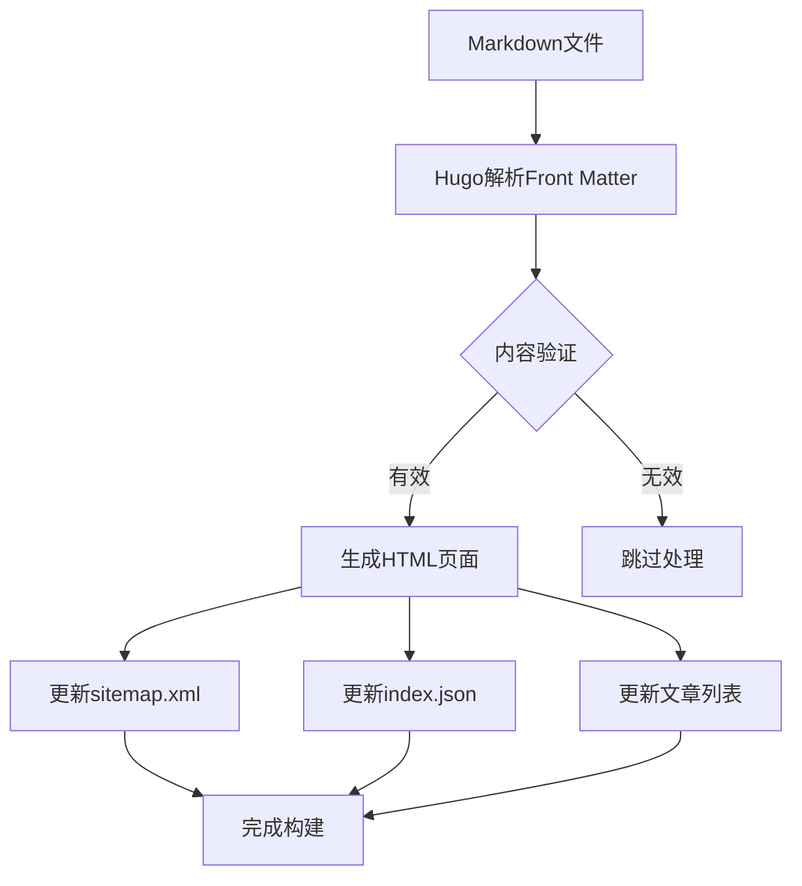
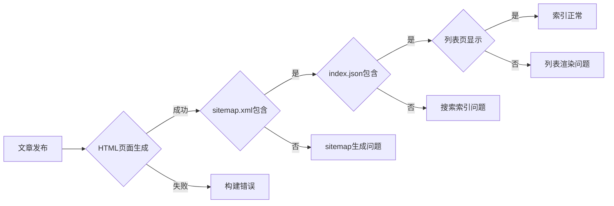
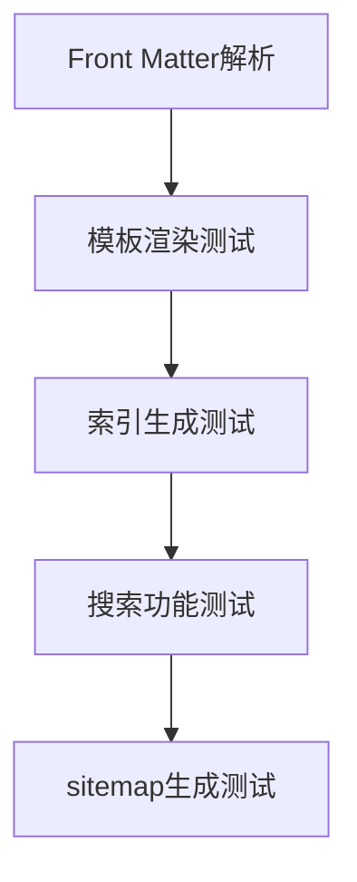

# Hugo文章索引问题修复设计

## 概述

针对Hugo静态网站中文章无法正确索引到sitemap.xml、搜索文件index.json和文章列表页面的问题，设计一套完整的诊断和修复方案。主要问题体现在新发布的文章（如`aixbt-pendle-tvl-migration-analysis-2025-08-18.md`）无法在网站主要入口和索引系统中正常显示。

## 技术架构

### 当前Hugo构建流程



### 问题识别流程



## 核心组件分析

### 1. Hugo配置系统

**关键配置参数**：
- `outputs`: 控制生成的输出格式
- `sitemap`: 站点地图配置
- `params.fuseOpts`: 搜索配置
- `menu.main`: 导航菜单配置

**当前配置状态**：
```toml
[outputs]
  home = ["HTML", "RSS", "JSON"]
  page = ["HTML"]
  section = ["HTML", "RSS"]

[sitemap]
  changefreq = "weekly"
  priority = 0.5
```

### 2. 模板系统

**核心模板文件**：
- `/layouts/index.html`: 主页文章列表
- `/layouts/index.json`: 搜索索引生成
- `/layouts/_default/list.html`: 文章列表页
- `/themes/PaperMod/layouts/_default/list.html`: 主题默认列表

**模板过滤逻辑**：
```go
{{- range first 6 (where .Site.RegularPages "Type" "posts") }}
{{- range .Site.RegularPages -}}
{{- $pages = where site.RegularPages "Type" "in" site.Params.mainSections }}
```

### 3. 内容处理机制

**文章识别条件**：
- Front Matter格式正确性
- 文件位置：`content/posts/`目录
- 文章类型：`Type: posts`
- 发布状态：`draft: false`

## 问题诊断

### 1. 构建缓存问题

**症状**：新文章HTML正常生成，但索引文件未更新
**原因**：Hugo构建缓存导致增量更新失效
**影响范围**：sitemap.xml、index.json、文章列表

### 2. 模板过滤问题

**症状**：特定文章在列表中不显示
**原因**：模板过滤条件过于严格或配置错误
**影响范围**：主页文章列表、/posts/列表页

### 3. 配置冲突问题

**症状**：部分索引功能失效
**原因**：主题配置与自定义配置冲突
**影响范围**：搜索功能、站点地图生成

## 修复方案设计

### 1. 立即修复操作

#### 清理构建缓存
```bash
# 清理Hugo缓存和输出目录
hugo --gc --cleanDestinationDir

# 强制重新构建所有内容
hugo --buildFuture --gc --minify
```

#### 验证文章Front Matter
```yaml
+++
date = '2025-08-18T15:30:01+08:00'
draft = false  # 确保非草稿状态
title = 'Pendle协议TVL迁移分析：...'
description = '...'
tags = ['DeFi', 'Pendle', ...]
categories = ['市场分析']
+++
```

### 2. 配置优化

#### 确保输出格式完整
```toml
[outputs]
  home = ["HTML", "RSS", "JSON"]
  page = ["HTML"]
  section = ["HTML", "RSS", "JSON"]  # 为section添加JSON输出
```

#### 优化sitemap配置
```toml
[sitemap]
  changefreq = "daily"
  priority = 0.8
  filename = "sitemap.xml"
```

#### 添加mainSections配置
```toml
[params]
  mainSections = ["posts"]  # 明确指定主要内容区域
```

### 3. 模板修复

#### 优化主页文章列表过滤
```go
{{- $pages := where .Site.RegularPages "Section" "posts" }}
{{- $pages = where $pages "Draft" false }}
{{- range first 6 $pages }}
```

#### 增强搜索索引生成
```go
{{- $pages := slice -}}
{{- range where .Site.RegularPages "Section" "posts" -}}
    {{- if not .Draft -}}
        {{- $pages = $pages | append (dict 
            "title" .Title 
            "content" .Plain 
            "permalink" .Permalink 
            "summary" .Summary 
            "tags" .Params.tags 
            "date" .Date.Format "2006-01-02"
        ) -}}
    {{- end -}}
{{- end -}}
{{- $pages | jsonify -}}
```

### 4. 自动化检测机制

#### 构建后验证脚本
```bash
#!/bin/bash
# 验证文章索引完整性

echo "验证sitemap.xml..."
if grep -q "aixbt-pendle-tvl-migration-analysis" public/sitemap.xml; then
    echo "✅ sitemap.xml 包含目标文章"
else
    echo "❌ sitemap.xml 缺失目标文章"
fi

echo "验证index.json..."
if grep -q "Pendle协议TVL迁移分析" public/index.json; then
    echo "✅ index.json 包含目标文章"
else
    echo "❌ index.json 缺失目标文章"
fi

echo "验证posts列表..."
if grep -q "aixbt-pendle-tvl-migration-analysis" public/posts/index.html; then
    echo "✅ posts列表包含目标文章"
else
    echo "❌ posts列表缺失目标文章"
fi
```

## 实施步骤

### 阶段1：紧急修复（1小时内）

1. **清理缓存重建**
   ```bash
   cd /Users/guoyingcheng/claude_pro/smartwallex-hugo-new
   hugo --gc --cleanDestinationDir
   hugo --buildFuture --gc --minify
   ```

2. **验证文章状态**
   - 检查Front Matter格式
   - 确认draft状态为false
   - 验证文件路径正确性

3. **快速验证**
   - 检查public/sitemap.xml
   - 检查public/index.json
   - 检查public/posts/index.html

### 阶段2：配置优化（2-4小时）

1. **更新Hugo配置**
   - 添加mainSections参数
   - 优化outputs配置
   - 调整sitemap设置

2. **模板增强**
   - 改进文章过滤逻辑
   - 增强错误处理
   - 添加调试信息

3. **测试验证**
   - 本地构建测试
   - 搜索功能测试
   - 多设备兼容性测试

### 阶段3：监控机制（长期）

1. **自动化检测**
   - 构建后验证脚本
   - CI/CD集成检查
   - 定期索引完整性验证

2. **性能监控**
   - 构建时间监控
   - 索引文件大小跟踪
   - 搜索响应时间测量

## 风险评估

### 技术风险

| 风险类型 | 概率 | 影响 | 缓解措施 |
|---------|------|------|---------|
| 配置冲突 | 中等 | 高 | 备份配置，分步骤修改 |
| 模板错误 | 低 | 中 | 本地测试验证 |
| 缓存问题 | 高 | 中 | 定期清理缓存机制 |
| 主题冲突 | 中等 | 中 | 隔离自定义模板 |

### 业务风险

| 风险类型 | 概率 | 影响 | 缓解措施 |
|---------|------|------|---------|
| SEO影响 | 低 | 高 | 快速修复，监控收录 |
| 用户体验 | 中等 | 中 | 渐进式修复 |
| 搜索功能 | 高 | 中 | 备用搜索方案 |

## 测试策略

### 单元测试



### 集成测试

1. **完整构建流程测试**
   - 从Markdown到HTML的完整链路
   - 多文章并发处理能力
   - 大量文章性能测试

2. **索引一致性测试**
   - sitemap.xml完整性
   - index.json正确性
   - 文章列表准确性

3. **跨平台兼容性测试**
   - 不同Hugo版本兼容性
   - 不同操作系统构建一致性
   - 部署环境适配性

## 监控与维护

### 关键指标监控

| 指标名称 | 监控频率 | 阈值 | 处理方式 |
|---------|---------|------|---------|
| 文章索引完整率 | 每次构建 | 100% | 自动重建 |
| sitemap更新及时性 | 每小时 | <5分钟 | 缓存清理 |
| 搜索索引准确性 | 每日 | >95% | 手动检查 |
| 构建时间 | 每次构建 | <2分钟 | 性能优化 |

### 预防性维护

1. **定期缓存清理**
   ```bash
   # 每周执行一次完全重建
   hugo --gc --cleanDestinationDir && hugo
   ```

2. **配置文件备份**
   - 每次修改前备份hugo.toml
   - 版本控制跟踪配置变更
   - 重要模板文件版本管理

3. **性能优化**
   - 定期分析构建性能
   - 优化模板执行效率
   - 监控内存和CPU使用

## 成功标准

### 功能性指标

- ✅ 新文章能在构建后立即出现在sitemap.xml中
- ✅ 搜索功能能正确索引和检索新文章
- ✅ 主页和文章列表页正确显示新文章
- ✅ 文章元数据完整且格式正确

### 性能指标

- ✅ 构建时间不超过当前基线的110%
- ✅ 索引文件大小增长合理（<20%每月）
- ✅ 搜索响应时间<500ms
- ✅ 页面加载时间<2秒

### 可靠性指标

- ✅ 99%的构建成功率
- ✅ 索引完整性>99.5%
- ✅ 7天内问题解决率100%
- ✅ 零回归问题发生率


