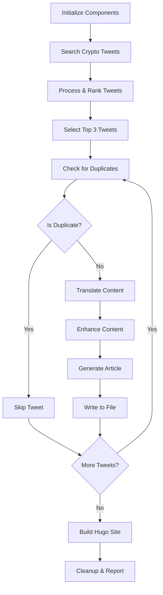

# Main Orchestration Workflow

## Overview

The main orchestration workflow (`src/index.js`) is the central component that coordinates all parts of the Twitter Crypto Content Automation system. It implements a complete end-to-end process from discovering trending cryptocurrency content on Twitter to publishing translated articles on a Hugo static site.

## Architecture

### Core Components

The workflow orchestrates the following components:

1. **TwitterClient** - Searches and retrieves cryptocurrency tweets
2. **ContentProcessor** - Analyzes and ranks tweets by engagement
3. **TranslationService** - Translates content to Chinese and enhances it
4. **ArticleGenerator** - Creates Hugo-compatible markdown articles
5. **DuplicateChecker** - Prevents publishing duplicate content
6. **FileWriter** - Manages file creation and naming
7. **HugoBuilder** - Builds the static site
8. **ConfigLoader** - Manages configuration and environment variables

### Workflow Steps



## Usage

### Basic Usage

```javascript
import { TwitterCryptoAutomation } from './src/index.js';

const automation = new TwitterCryptoAutomation();

// Initialize and run the complete workflow
await automation.initialize();
const report = await automation.executeWorkflow();

console.log('Workflow completed:', report.success);
console.log('Articles generated:', report.statistics.articlesGenerated);
```

### Command Line Usage

```bash
# Run the complete workflow
npm start

# Run with environment variables
TWITTER_BEARER_TOKEN=your_token npm start

# Run in development mode with file watching
npm run dev
```

### Demo Scripts

```bash
# Interactive demo
npm run demo

# Full workflow demo with real APIs
npm run demo:full

# Mock demo (no API calls)
npm run demo:mock

# Test individual components
npm run demo:components

# Validate configuration
npm run demo:config
```

## Configuration

### Environment Variables

Required environment variables:

```bash
TWITTER_BEARER_TOKEN=your_twitter_bearer_token
```

Optional environment variables:

```bash
NODE_ENV=development|production
LOG_LEVEL=error|warn|info|debug
GOOGLE_TRANSLATE_API_KEY=your_google_translate_key
AZURE_TRANSLATOR_KEY=your_azure_translator_key
SLACK_WEBHOOK_URL=your_slack_webhook_url
```

### Configuration Files

The system uses configuration files in the `config/` directory:

- `config/default.json` - Base configuration
- `config/development.json` - Development overrides
- `config/production.json` - Production overrides

Example configuration:

```json
{
  "twitter": {
    "baseUrl": "https://api.twitter.com/2",
    "searchEndpoint": "/tweets/search/recent",
    "searchKeywords": [
      "cryptocurrency OR crypto",
      "blockchain OR bitcoin OR BTC",
      "ethereum OR ETH OR DeFi",
      "NFT OR Web3 OR altcoin"
    ],
    "maxResults": 50,
    "rateLimits": {
      "searchRequests": 300,
      "windowMinutes": 15
    }
  },
  "content": {
    "minRetweetCount": 10,
    "minCharacterCount": 50
  },
  "translation": {
    "primaryService": "local",
    "targetLanguage": "zh-CN",
    "fallbackEnabled": true
  },
  "hugo": {
    "contentDir": "content/posts",
    "siteRoot": ".",
    "outputDir": "public"
  },
  "storage": {
    "processedTweetsPath": "data/processed-tweets.json"
  }
}
```

## Error Handling

### Error Recovery Strategies

The workflow implements comprehensive error handling:

1. **Rate Limiting**: Automatic backoff and retry for Twitter API rate limits
2. **Translation Failures**: Fallback to original content with basic enhancement
3. **Individual Tweet Failures**: Continue processing remaining tweets
4. **Build Failures**: Detailed error reporting and recovery suggestions
5. **Resource Cleanup**: Ensures cleanup even after failures

### Error Types

```javascript
// Rate limit errors
{
  step: 'twitter_search',
  error: 'Rate limit exceeded (429)',
  retryAfter: 900000 // milliseconds
}

// Translation errors
{
  step: 'article_generation',
  tweetId: '1234567890',
  error: 'Translation service unavailable'
}

// Build errors
{
  step: 'hugo_build',
  error: 'Hugo not found or not installed'
}
```

## Monitoring and Logging

### Log Levels

The system supports multiple log levels:

- **ERROR**: Critical errors that stop execution
- **WARN**: Non-critical issues that don't stop execution
- **INFO**: General workflow progress information
- **DEBUG**: Detailed debugging information

### Execution Reports

Each workflow execution generates a comprehensive report:

```javascript
{
  executionTime: 45000, // milliseconds
  startTime: "2025-08-16T10:00:00.000Z",
  endTime: "2025-08-16T10:00:45.000Z",
  statistics: {
    tweetsFound: 25,
    tweetsProcessed: 20,
    articlesGenerated: 3,
    duplicatesSkipped: 2,
    errorsEncountered: 1
  },
  errors: [
    {
      step: "article_generation",
      tweetId: "1234567890",
      error: "Translation failed"
    }
  ],
  success: true
}
```

## Testing

### Integration Tests

Run comprehensive integration tests:

```bash
# Run all integration tests
npm run test:integration

# Run specific integration test
npm test -- tests/integration/MainWorkflow.integration.test.js
```

### Test Coverage

The integration tests cover:

- Complete workflow execution
- Error handling and recovery
- Rate limiting scenarios
- Duplicate detection
- Resource cleanup
- Logging and monitoring

### Mock Testing

For testing without API calls:

```bash
npm run demo:mock
```

## Performance Considerations

### Optimization Strategies

1. **Parallel Processing**: Process multiple tweets concurrently where possible
2. **Caching**: Cache translation results and duplicate checks
3. **Rate Limit Management**: Intelligent rate limit handling to maximize throughput
4. **Resource Management**: Proper cleanup to prevent memory leaks

### Performance Metrics

Monitor these key metrics:

- **Execution Time**: Total workflow duration
- **API Usage**: Twitter API request count and rate limit status
- **Success Rate**: Percentage of successful article generations
- **Error Rate**: Frequency and types of errors encountered

## Deployment

### GitHub Actions Integration

The workflow is designed to run in GitHub Actions:

```yaml
name: Twitter Crypto Content Automation
on:
  schedule:
    - cron: '0 1,13 * * *'  # 9 AM and 9 PM Beijing time
  workflow_dispatch:

jobs:
  generate-content:
    runs-on: ubuntu-latest
    steps:
      - uses: actions/checkout@v3
      - uses: actions/setup-node@v3
        with:
          node-version: '18'
      - run: npm ci
        working-directory: automation
      - run: npm start
        working-directory: automation
        env:
          TWITTER_BEARER_TOKEN: ${{ secrets.TWITTER_BEARER_TOKEN }}
```

### Local Development

For local development and testing:

```bash
# Install dependencies
npm install

# Copy environment template
cp .env.example .env

# Edit .env with your API keys
# Run the workflow
npm start
```

## Troubleshooting

### Common Issues

1. **Twitter API Authentication**
   ```
   Error: Twitter Bearer Token is required
   Solution: Set TWITTER_BEARER_TOKEN environment variable
   ```

2. **Hugo Not Found**
   ```
   Error: Hugo not found or not installed
   Solution: Install Hugo from https://gohugo.io/installation/
   ```

3. **Rate Limit Exceeded**
   ```
   Error: Rate limit exceeded (429)
   Solution: Wait for rate limit reset or reduce maxResults
   ```

4. **Configuration Errors**
   ```
   Error: Failed to load config
   Solution: Check config files syntax and required fields
   ```

### Debug Mode

Enable debug logging for detailed troubleshooting:

```bash
LOG_LEVEL=debug npm start
```

## Contributing

### Adding New Features

1. Create new components in appropriate directories
2. Update the main workflow to integrate new components
3. Add comprehensive tests
4. Update documentation

### Code Style

- Use ES6+ features and modules
- Follow async/await patterns
- Implement proper error handling
- Add JSDoc comments for all public methods
- Write comprehensive tests

### Testing Requirements

- Unit tests for all components
- Integration tests for workflow steps
- Error scenario testing
- Performance testing for large datasets

## API Reference

### TwitterCryptoAutomation Class

#### Methods

- `initialize()` - Initialize all components
- `executeWorkflow()` - Run complete workflow
- `searchCryptoTweets()` - Search for crypto tweets
- `processAndRankTweets(tweets)` - Process and rank tweets
- `generateArticleFromTweet(tweet)` - Generate article from tweet
- `writeArticlesToFiles(articles)` - Write articles to files
- `buildHugoSite()` - Build Hugo site
- `cleanup()` - Cleanup resources
- `generateReport()` - Generate execution report

#### Properties

- `config` - Loaded configuration object
- `components` - Initialized component instances
- `stats` - Execution statistics
- `logger` - Logger instance

### Logger Class

#### Methods

- `error(message, ...args)` - Log error messages
- `warn(message, ...args)` - Log warning messages
- `info(message, ...args)` - Log info messages
- `debug(message, ...args)` - Log debug messages

## License

This project is licensed under the MIT License. See the LICENSE file for details.