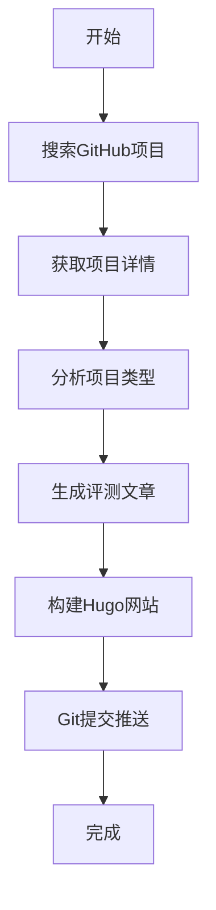

# 🤖 加密货币项目自动分析器

自动抓取GitHub上最热门的加密货币项目，生成专业评测文章并发布到Hugo网站。

## 🚀 快速开始

### 1. 安装依赖

```bash
# 安装Python依赖
pip3 install -r scripts/requirements.txt

# 给脚本添加执行权限
chmod +x scripts/*.sh
chmod +x scripts/*.py
```

### 2. GitHub Token配置

**GitHub Actions环境**: 
- ✅ 无需配置，自动使用内置的`GITHUB_TOKEN`
- ✅ 具有完整的仓库读写权限

**本地测试环境**: 
- 可选：设置环境变量 `export GITHUB_TOKEN=your_token`
- 不设置也可以运行，但API调用次数会受限

### 3. 手动运行测试

```bash
# 在Hugo项目根目录运行
./scripts/auto-publish.sh
```

### 4. GitHub Actions自动化

项目已配置GitHub Actions工作流：

- **自动运行**: 每天北京时间00:00自动触发
- **手动触发**: 在GitHub仓库的Actions页面手动运行
- **无需服务器**: 完全基于GitHub云端运行
- **自动Token**: 使用GitHub Actions内置的`GITHUB_TOKEN`，无需手动配置

## 📋 功能特性

### 🔍 智能项目发现
- **多策略搜索**: 按创建日期、最近活动、趋势项目、编程语言等多种策略搜索
- **智能去重**: 自动避免重复分析已处理过的项目
- **质量过滤**: 基于星标数、更新频率、项目描述等多维度质量评估
- **历史记录**: 永久记录已分析项目，确保内容不重复

### 📊 深度项目分析
- 获取项目基本信息（Stars、Forks、语言等）
- 分析README内容和项目描述
- 统计编程语言构成
- 追踪最近的开发动态
- 智能分类项目类型

### ✍️ 专业文章生成
- 自动生成SEO优化的文章标题和描述
- 包含项目技术分析和评测
- 添加风险提示和使用建议
- 统一的作者信息和引流内容

### 🚀 自动化发布
- 自动构建Hugo网站
- Git提交和推送到GitHub
- 详细的日志记录
- 错误处理和恢复

## 📁 文件结构

```
.github/workflows/
├── daily-crypto-analysis.yml    # 每日自动分析工作流
└── manual-crypto-analysis.yml   # 手动触发工作流

scripts/
├── crypto-project-analyzer.py   # 主分析脚本
├── auto-publish.sh              # 本地发布脚本（可选）
├── manage-history.py            # 项目历史记录管理工具
├── config.py                    # 配置文件
├── requirements.txt             # Python依赖
├── test-*.py                    # 测试脚本
└── README.md                   # 使用说明

data/
└── analyzed_projects.json      # 已分析项目历史记录
```

## ⚙️ 配置选项

编辑 `scripts/config.py` 可以自定义：

- **搜索关键词**: 修改 `SEARCH_KEYWORDS`
- **项目筛选**: 调整 `MIN_STARS`、`DAYS_BACK`、`MAX_PROJECTS`
- **项目分类**: 更新 `PROJECT_CATEGORIES`
- **作者信息**: 修改 `AUTHOR_INFO`

## 📊 运行流程



## 🛠️ 项目历史管理

### 查看统计信息
```bash
python scripts/manage-history.py stats
```

### 列出所有已分析项目
```bash
python scripts/manage-history.py list
```

### 搜索特定项目
```bash
python scripts/manage-history.py search "关键词"
```

### 移除特定项目（重新分析）
```bash
python scripts/manage-history.py remove "用户名/项目名"
```

### 清空所有历史记录
```bash
python scripts/manage-history.py clear
```

## 🔧 故障排除

### GitHub Actions问题

1. **工作流失败**
   - 检查Actions页面的详细日志
   - 确认Python依赖是否正确安装

2. **API限制错误**
   - GitHub Actions自动提供GITHUB_TOKEN
   - 如仍有限制，可创建Personal Access Token

3. **推送权限错误**
   - 确保仓库设置允许Actions写入
   - 检查分支保护规则

### 本地测试

```bash
# 本地运行测试
export GITHUB_TOKEN="your_token"
python scripts/crypto-project-analyzer.py

# 查看生成的文章
ls -la content/posts/*$(date +%Y-%m-%d)*
```

### 日志查看

- **GitHub Actions**: 在仓库的Actions页面查看详细日志
- **本地运行**: 直接在终端查看输出

## 📈 效果预期

每日自动生成3篇高质量的GitHub项目评测文章：
- **SEO优化**: 标题、描述、关键词完整
- **内容丰富**: 技术分析、优缺点、使用建议
- **专业权威**: 统一的作者信息和品牌形象
- **自动化**: 无需人工干预，定时发布

## 🛡️ 注意事项

1. **API限制**: GitHub API有频率限制，建议设置Token
2. **内容质量**: 生成的内容基于公开信息，建议人工审核
3. **版权合规**: 确保引用内容符合开源协议
4. **风险提示**: 文章包含投资风险警告

## 🔄 更新维护

定期更新脚本以适应：
- GitHub API变化
- 新的项目类型
- SEO优化需求
- 内容质量提升

---

*这个自动化系统将帮助你的网站持续产出高质量的加密货币项目评测内容，提升SEO排名和用户价值！*